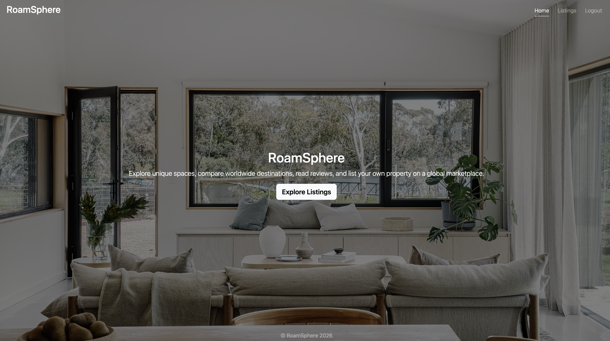
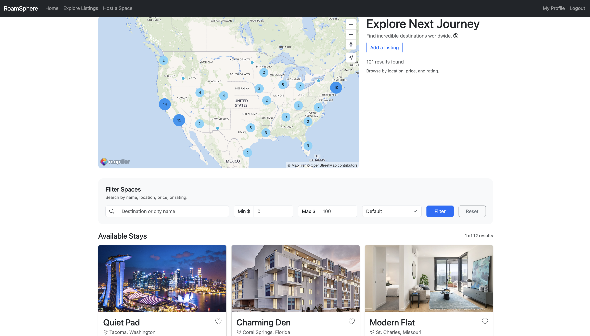
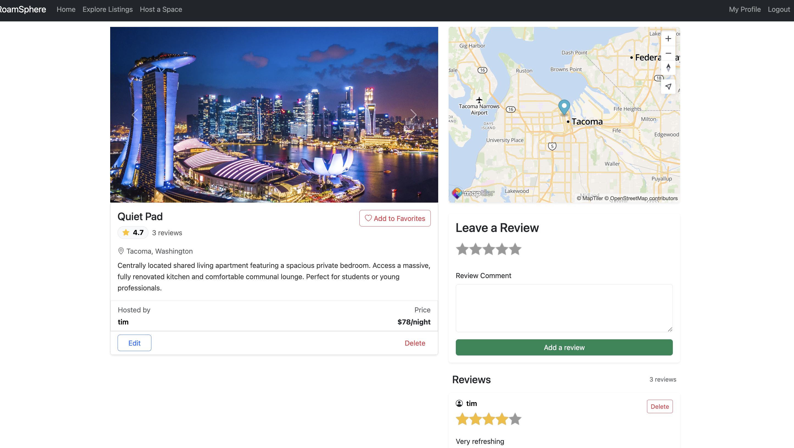
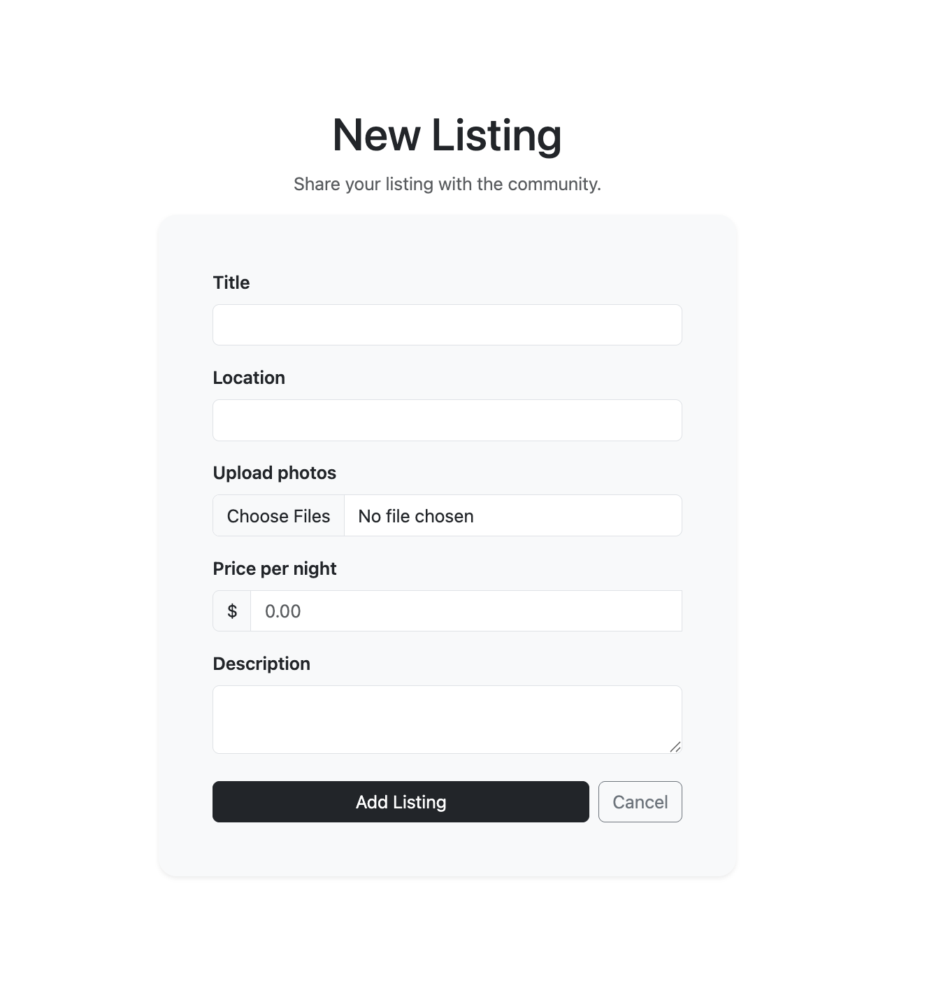
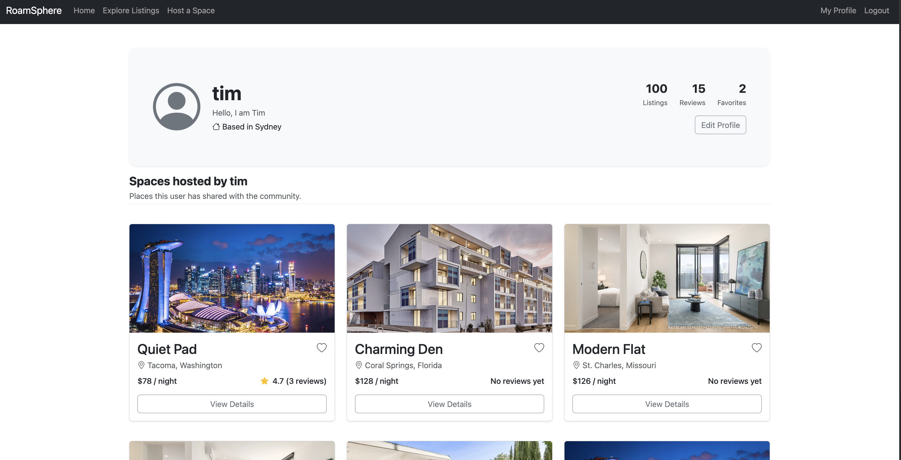

# RoamSphere
RoamSphere is a full-stack web application where users can explore, create, review, and share unique destinations across the world. 

## Features
- User authentication and authorization
- Create, edit, and delete listings
- Upload campground images with Cloudinary
- Interactive maps and geolocation
- Search, filtering, and sorting
- Add/remove listings from favorites
- Reviews and ratings
- User profiles and user listings
- Pagination for large listing collections
- Flash messages and error handling
- Responsive mobile-friendly design

## Tech Stack
### Backend
- Node.js
- Express.js

### Database
- MongoDB
- Mongoose

### Frontend
- HTML5
- CSS3
- Bootstrap 5
- JavaScript
- EJS

### Authentication
- Passport.js
- Express Session

### Cloud Services
- Cloudinary
- MapTiler

### Deployment
- Render

## Project Inspiration 
RoamSphere was originally inspired by *YelpCamp* project from Colt Steele's Web Developer Bootcamp.
While the project began as a guided learning exercise, it has been extended with additional features such as search, filtering, sorting, pagination. The goal was to deepen my understanding of full-stack application development and build a more feature-rich listing discovery platform.

## Screenshots
- HomePage
Landing page where users can discover destinations.


- Listings Page
Users can search, filter, sort, and explore available destinations.


- Listing Details
Detailed destination information including images, maps, and reviews.


- Create Listing
Authenticated users can create and share new destinations.


- User Profile
View personal listings and manage favorite destinations.


## Security & Validation

- Server-side validation using Joi
- Sanitization of user-generated content
- Protection against NoSQL injection attacks
- Secure authentication with Passport.js
- Session and cookie security enhancements
- HTTP security headers configured with Helmet

## Installation

1. Clone the repository

```bash
git clone https://github.com/EdbertCA/roamsphere.git
cd roamsphere
```

2. Install dependencies

```bash
npm install
```

3. Create a `.env` file in the project root and add the required environment variables.

4. Start the application

```bash
npm start
```

5. Visit `http://localhost:3000` in your browser.

## Environment Variables
Create a .env file and configure:

```env
CLOUDINARY_CLOUD_NAME=
CLOUDINARY_KEY=
CLOUDINARY_SECRET=
MAPTILER_API_KEY=
DB_URL=
SECRET=
```

## Key Enhancements Beyond YelpCamp
- Search functionality
- Advanced filtering and sorting
- User favorites system
- User profile pages
- Pagination
- Improved responsive UI
- Enhanced map interactions

## Future Improvements
* Real-time messaging between users
* Advanced recommendation system based on user interests
* Social features such as following users and activity feeds
* Booking and reservation functionality
* REST API for third-party integrations
* Migration to React or Next.js frontend
* Enhanced analytics dashboard for listing owners